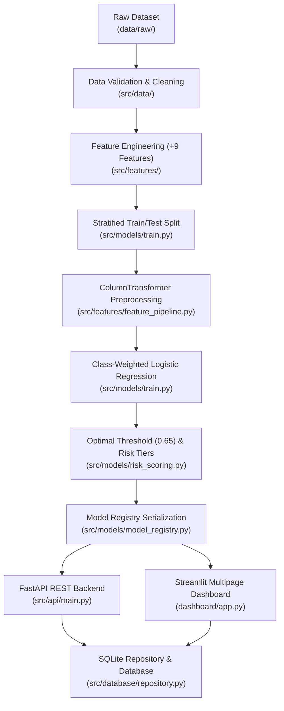

# Complete Viva & Academic Review Project Map

**Project**: `financial-fraud-detection`  
**Target Program**: College / IITM BS Project Viva  
**Purpose**: Direct concept-to-code mapping to instantly navigate questions on machine learning theory, data engineering, backend architecture, database design, API contracts, security workflows, and production deployment.

---

## 1. Concept-to-Code Mapping Index

---

## 2. Granular Implementation Details for Examiner Questions

### 1. Data Ingestion
- **Exact File**: `src/data/ingestion.py`
- **Key Functions / Classes**: `load_raw_dataset(path: Optional[Path]) -> pd.DataFrame`
- **Viva Answer Summary**: Reads the master dataset from `data/raw/financial_fraud_detection_dataset.csv` with strict validation on existence, encoding, and schema structure.

### 2. Data Cleaning & Outlier Handling
- **Exact File**: `src/data/cleaning.py`
- **Key Functions / Classes**: `clean_transaction_data(df: pd.DataFrame) -> pd.DataFrame`, `detect_outliers_iqr(...)`, `remove_duplicate_records(...)`
- **Viva Answer Summary**: Trims string whitespace, parses date strings to standard datetime objects, validates numerical bounds (e.g. non-negative amounts), and ensures zero missing values and zero duplicate rows.

### 3. Data Validation & Schema Integrity
- **Exact File**: `src/data/validation.py`
- **Key Functions / Classes**: `validate_dataset_schema(df: pd.DataFrame) -> Tuple[bool, List[str]]`
- **Viva Answer Summary**: Asserts that all 14 mandatory columns exist with valid data types, positive transaction amounts, and valid categories.

### 4. Domain Feature Engineering
- **Exact File**: `src/features/engineering.py`
- **Key Functions / Classes**: `build_features(df: pd.DataFrame) -> Tuple[pd.DataFrame, List[str]]`
- **Engineered Domain Features (9 Total)**:
  1. `spend_to_avg_ratio`: Ratio of current transaction amount to customer average spend ($\text{amount} / \text{avg\_spend}$).
  2. `is_high_value_transaction`: Binary flag where $\text{amount} > 3 \times \text{avg\_spend}$.
  3. `transaction_hour`: Extracted hour of transaction ($0 - 23$).
  4. `transaction_day_of_week`: Day of week ($0 = \text{Monday}, 6 = \text{Sunday}$).
  5. `is_night_transaction`: Binary flag for high-risk nocturnal hours ($23:00 - 05:00$).
  6. `is_weekend`: Binary flag for Saturday / Sunday transactions.
  7. `account_age_years`: Account age normalized to years ($\text{days} / 365.25$).
  8. `suspicious_keyword_flag`: Binary indicator ($1$ for "Yes", $0$ for "No").
  9. `is_international_flag`: Binary indicator for cross-border transactions.

### 5. Categorical Encoding & Pipeline Transformations
- **Exact File**: `src/features/encoding.py` & `src/features/feature_pipeline.py`
- **Key Functions / Classes**: `create_preprocessing_pipeline() -> ColumnTransformer`
- **Viva Answer Summary**: Combines `RobustScaler` on numerical features (robust to financial amount outliers) and `OneHotEncoder(handle_unknown='ignore', sparse_output=False)` on categorical features (`Merchant_Category`, `Payment_Method`, `Device_Type`, `Location`). Expands raw features to 34 standardized numerical inputs.

### 6. Train / Test Split & Data Leakage Prevention
- **Exact File**: `src/models/train.py`
- **Key Functions / Classes**: `train_fraud_models()` using `train_test_split(..., stratify=y, test_size=0.20, random_state=42)`
- **Viva Answer Summary**: Splits 5,000 rows into 4,000 training rows and 1,000 test rows with strict stratification. The `ColumnTransformer` is fitted *only* on training data (`fit_transform(X_train)`) and applied (`transform(X_test)`) to eliminate data leakage.

### 7. Machine Learning Model Selection & Class Weighting
- **Exact File**: `src/models/train.py` & `src/models/evaluate.py`
- **Key Functions / Classes**: `LogisticRegression(class_weight='balanced', solver='liblinear', random_state=42, C=1.0)`
- **Viva Answer Summary**: Addresses class imbalance (9.64% fraud rate) by tuning loss penalization (`class_weight='balanced'`). Compared against Random Forest and XGBoost. Logistic Regression was selected as active production model due to superior calibration, explainable linear coefficients, and ultra-low inference latency (< 5ms).

### 8. Optimal Operating Threshold Calibration (0.65)
- **Exact File**: `src/models/risk_scoring.py` & `models/metadata/model_metadata.json`
- **Key Value**: `selected_threshold = 0.65`
- **Viva Answer Summary**: Rather than defaulting to standard $0.50$, precision-recall sensitivity analysis identified $0.65$ as the optimal operating point, delivering **100% Test Recall (1.000)** on actual fraud cases while maintaining $0.8904$ ROC-AUC.

### 9. Three-Tier Risk Scoring Engine
- **Exact File**: `src/models/risk_scoring.py`
- **Key Functions / Classes**: `calculate_risk_score(probability: float, ...) -> Dict[str, Any]`
- **Tier Definitions**:
  - **Low Risk**: $\text{Prob} < 0.35$ | Risk Score: $0.0 - 34.9$ | Action: `APPROVE`
  - **Medium Risk**: $0.35 \le \text{Prob} < 0.65$ | Risk Score: $35.0 - 64.9$ | Action: `AUTHENTICATE_2FA`
  - **High Risk**: $\text{Prob} \ge 0.65$ | Risk Score: $65.0 - 100.0$ | Action: `FLAG_FOR_REVIEW`

### 10. Model Registry & Artifact Serialization
- **Exact File**: `src/models/model_registry.py`
- **Key Functions / Classes**: `ModelRegistry.save_active_model()`, `ModelRegistry.load_active_model()`
- **Stored Files**:
  - `models/trained/fraud_model.joblib` (1.1 KB)
  - `models/preprocessing/preprocessor.joblib` (5.6 KB)
  - `models/metadata/model_metadata.json` (2.4 KB)

### 11. Database Models & Normalized Schema
- **Exact File**: `src/database/models.py` & `database/schema.sql`
- **Tables**:
  1. `transactions`: Stores all 5,000 transactions with customer, amount, merchant, features, and model scores.
  2. `predictions`: Audit log of every model inference request with timestamp, probability, and threshold.
  3. `alerts`: Security review queue records with severity (`CRITICAL`, `HIGH`, `MEDIUM`), status (`OPEN`, `INVESTIGATING`, `RESOLVED`, `DISMISSED`), and resolution notes.

### 12. Repository Pattern & CRUD Operations
- **Exact File**: `src/database/repository.py`
- **Key Classes**: `TransactionRepository`, `PredictionRepository`, `AlertRepository`
- **Viva Answer Summary**: Abstracts database access using clean repository design, supporting pagination, full-text multi-criteria search, date filtering, time-series aggregations, and atomic status updates.

### 13. FastAPI REST API Layer
- **Exact File**: `src/api/main.py` & `src/api/routes/*.py`
- **Key Routes**:
  - `GET /health` (`src/api/routes/health.py`): Liveness check.
  - `GET /ready` (`src/api/routes/health.py`): Readiness probe validating DB pool & ML artifacts.
  - `GET /transactions` (`src/api/routes/transactions.py`): Paginated explorer.
  - `POST /predictions/predict` (`src/api/routes/predictions.py`): Single real-time inference.
  - `POST /predictions/batch` (`src/api/routes/predictions.py`): Bulk inference up to 500 items.
  - `GET /analytics/summary` (`src/api/routes/analytics.py`): Portfolio summary metrics.
  - `GET /analytics/time-series` (`src/api/routes/analytics.py`): Daily volume & fraud trend data.
  - `GET /alerts` & `PATCH /alerts/{id}/status` (`src/api/routes/alerts.py`): Security alert workflow.

### 14. Pydantic v2 Data Contracts (DTOs)
- **Exact File**: `src/database/schemas.py`
- **Key Schemas**: `TransactionBase`, `PredictionRequest`, `PredictionResponse`, `BatchPredictionRequest`, `AlertStatusUpdate`, `AnalyticsSummary`.

### 15. Streamlit Interactive Multipage Frontend
- **Exact File**: `dashboard/app.py` & `dashboard/pages/*.py`
- **Architecture**: Modern `st.navigation` shell with 6 distinct view pages:
  1. `dashboard/pages/overview.py`: Executive portfolio KPIs & charts.
  2. `dashboard/pages/transactions.py`: Granular transaction search & record inspector.
  3. `dashboard/pages/fraud_analysis.py`: Categorical, device, payment, and location risk charts.
  4. `dashboard/pages/risk_analysis.py`: Probability distribution & threshold sensitivity.
  5. `dashboard/pages/alerts.py`: Security review queue with interactive status action buttons.
  6. `dashboard/pages/model_performance.py`: Model benchmarks, ROC/PR curves, confusion matrix.

### 16. Security Alert Engine & Monitoring
- **Exact File**: `src/monitoring/alert_engine.py` & `src/monitoring/fraud_monitor.py`
- **Viva Answer Summary**: Automatically triggers security alerts for transactions scored as HIGH or MEDIUM risk, assigning severity (`CRITICAL` for $> 85\%$, `HIGH` for $> 65\%$, `MEDIUM` for $> 35\%$) and skipping duplicate active alerts.

### 17. Automated Test Suite
- **Exact File**: `tests/test_*.py` & `tests/conftest.py`
- **Coverage**: 53 unit and integration tests across API routes, data cleaning, database queries, feature pipelines, model serialization, monitoring streams, and production edge-case hardening (422 validation, 404 lookups, negative amounts, oversized batches).

### 18. Docker Containerization & Multi-Container Orchestration
- **Exact Files**: `Dockerfile`, `Dockerfile.dashboard`, `docker-compose.yml`
- **Viva Answer Summary**: Uses lightweight `python:3.11-slim` multi-stage container builds with embedded healthchecks, volume-mounted storage, and automatic backend-to-frontend service discovery.

### 19. Continuous Integration & CD
- **Exact File**: `.github/workflows/ci.yml`
- **Viva Answer Summary**: GitHub Actions workflow automatically checks code quality with Ruff, asserts ML artifact presence, verifies FastAPI imports, runs the 53-test pytest suite, and builds Docker images on every push or pull request.
