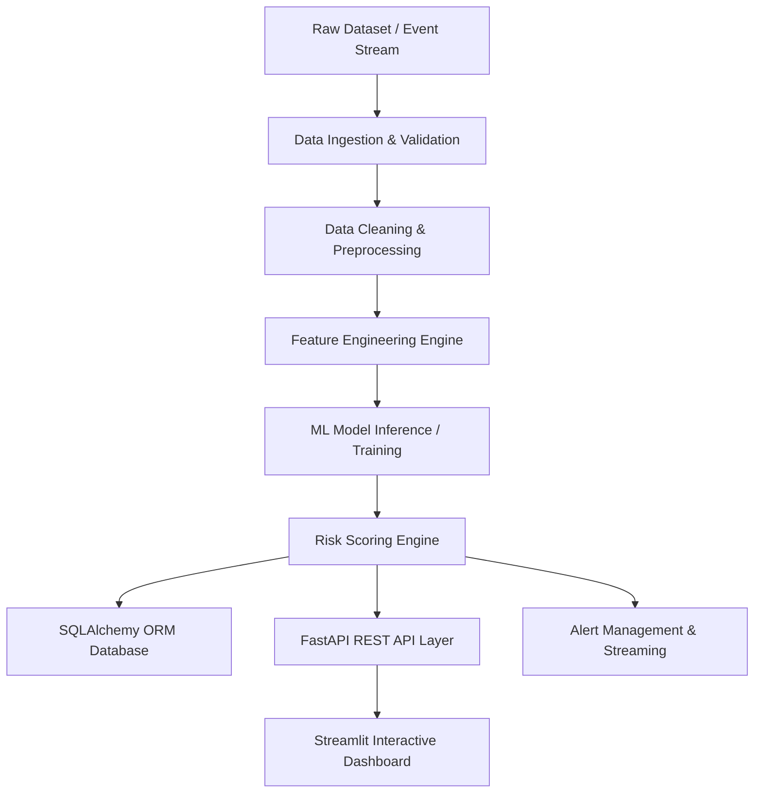

# System Architecture & Design Specification

## Overview
The Financial Fraud Detection Platform is an end-to-end Machine Learning ecosystem designed for modular data ingestion, feature engineering, real-time risk scoring, and interactive fraud analytics monitoring.

## Architectural Layers

1. **Data Ingestion & Validation (`src/data`)**
   - Validates CSV schemas, data types, missing values, and column integrity.
   - Enforces strict immutability on `data/raw/financial_fraud_detection_dataset.csv`.

2. **Feature Engineering & Transformation (`src/features`)**
   - Computes transaction velocity, historical spend ratios, categorical encoding, and risk flags.

3. **Machine Learning Pipeline (`src/models`)**
   - Model training, evaluation (ROC-AUC, Precision, Recall), model serialization via `ModelRegistry`.
   - Risk scoring algorithm categorizing transactions into **LOW**, **MEDIUM**, or **HIGH** risk tiers.

4. **Persistence & Database Layer (`src/database`)**
   - SQLite DB via SQLAlchemy ORM for transaction records, prediction outputs, and security alerts.

5. **REST API Service (`src/api`)**
   - FastAPI application exposing health metrics (`GET /health`), transaction queries, inference endpoints, and alert workflows.

6. **Interactive Dashboard (`dashboard/`)**
   - Modern glassmorphic Streamlit UI providing executive summary KPIs, transaction filtering, risk analysis, alert resolution queues, and model performance metrics.

7. **Real-time Monitoring (`src/monitoring`)**
   - Simulates streaming events and flags high-risk transactions for automated alert generation.
